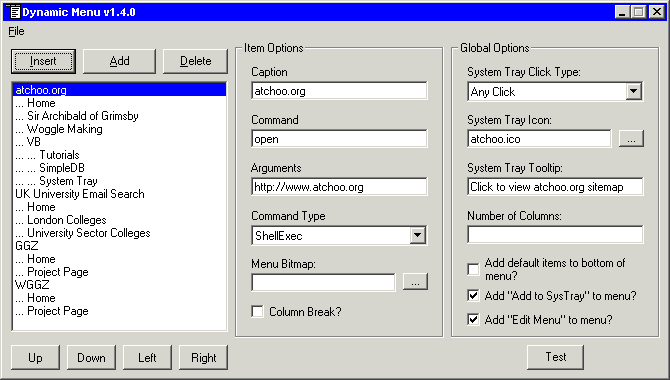



## DynMenu

### Description

Learn how to create fully functional menus with the Windows API. DynMenu is a utility that allows users to create their own functional popup menus that can be accessed by double clicking a .dym file. The menus can also be added to the system tray.

DynMenu is used to both create .dym files and to show the menu.

This code is the complete source for DynMenu. It shows how to use GGZMLParser, a minimal SAX XML parser and also how to create menus "on the fly" using the Windows API. In addition to the usual code you may have seen for creating menus in this way, the DynMenu code also supports infinitely (resource restricted anyway) many sub menus, splitting menus into a number of columns and adding checked/unchecked menu graphics as are often seen in the VB menus.
 
### More Info
 
DynMenu and GGZMLParser are both released under the GNU General Public License v2. Read the file copying.txt to see your rights.

Essentially, you are allowed to use the code in DynMenu as long as any code in the same program as the DynMenu code is also released under the GPL and you must release the source code as well if you release a binary.

Adding checked/unchecked menu graphics does not work perfectly when loading bitmaps from disk as is the case with DynMenu.

             |
---                |---
**Submitted On**   |2002-09-19 19:05:30
**By**             |[Roger Light](https://github.com/Planet-Source-Code/PSCIndex/blob/master/ByAuthor/roger-light.md)
**Level**          |Intermediate
**User Rating**    |5.0 (15 globes from 3 users)
**Compatibility**  |VB 6\.0
**Category**       |[Complete Applications](https://github.com/Planet-Source-Code/PSCIndex/blob/master/ByCategory/complete-applications__1-27.md)
**World**          |[Visual Basic](https://github.com/Planet-Source-Code/PSCIndex/blob/master/ByWorld/visual-basic.md)
**Archive File**   |[DynMenu1335879202002\.zip](https://github.com/Planet-Source-Code/roger-light-dynmenu__1-38703/archive/master.zip)

